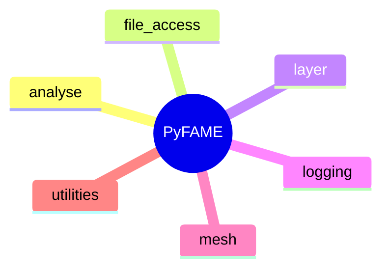

# Overview

PyFAME: The Python Facial Analysis and Manipulation Environment is a Python toolkit for performing a variety of classical facial psychology manipulations over both still images and videos. The root of PyFAME's capabilities come from its modular, layer based construction of all of it's available facial manipulations. The complexity of object-oriented programming is obscured from the user with layer factory functions, which have been set up to produce reasonable results with preprogrammed default configurations. Additionally, PyFAME offers a variety of timing functions that can be used for precise timing configuration of the manipulation layers; precise onset and offset, the rate of growth and the shape of the timing curve can be set through PyFAME's TimingConfiguration class. PyFAME can be used to perform individual facial psychology experiments and analysis, or for large scale batch-creation of experimental stimuli. These stimuli can be used in formal research experiments or as training inputs to a variety of machine learning algorithms. 

## Package Structure



The PyFAME package contains six top-level submodules: with `logging`and `mesh` primarily containing developer tools or internal package dependencies, and with `analyse`, `file_access`, `layer` and `utilities` containing the user-facing classes and methods.
All of PyFAME's manipulation layers and any associated methods or constants are available by default with a top-level import as seen below.
``` python
import pyfame as pf

# Manipulation Layers
mask = pf.layer_mask()                      # Layers can be instantiated as is,
darken = pf.layer_colour_brightness()       # all input parameters will be filled with reasonable defaults.

# Constants and helpful utilities
facial_mask_path = pf.FACE_OVAL_PATH        # Many predefined constants are available for all manipulation params.
file_paths = pf.make_paths(exclude_directories = ["foo", "bar"])

# Layer attributes and configuration
config = pf.TimingConfiguration(timing_function = pf.timing_gaussian())
pf.apply_layers(file_paths, layers=[mask, darken])      # Always the last call when applying manipulations.

```

## Underlying Model
PyFAME leverages MediaPipe's Face Landmarker solution (built on top of BlazeFace) to identify and track facial landmarks. While for the majority of manipulations the Face Landmarker is instantiated with reasonable defaults internally, parameters `min_detection_confidence`, `min_tracking_confidence` and `static_image_mode` can be manipulated within the `TimingConfiguration` of PyFAME's manipulation layers.
``` python
import pyfame as pf
import mediapipe as mp

# What the internal instantiation of the Face Landmarker looks like
face_mesh = mp.solutions.face_mesh.FaceMesh(max_num_faces = 1, min_detection_confidence = min_detection_confidence,
                                    min_tracking_confidence = min_tracking_confidence, static_image_mode = static_image_mode)

# To alter the values this instantiation is recieving, set them in a TimingConfiguration
# object and pass them to your layer instantiation
config = pf.TimingConfiguration(min_tracking_confidence = 0.3, min_detection_confidence = 0.5)
colour_layer = pf.layer_colour(timing_configuration = config)
```

For more information on MediaPipe's FaceMesh solution, [see here.](https://ai.google.dev/edge/mediapipe/solutions/vision/face_landmarker)

If you would like to learn more about how to install PyFAME and it's dependencies, or you would like to jump right into a simple example, please see the [Getting Started](../guide/getting_started.md) page.